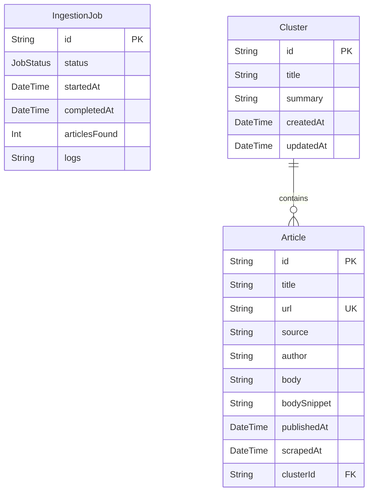

# Database Schema Design

This document details the database schema configuration mapped via Prisma ORM for the News Pulse application.

## Entity Relationship Diagram


## Prisma Schema Definition

The actual Prisma models are implemented in [schema.prisma](file:///home/yb175/projects/news-pulse/db/prisma/schema.prisma):

```prisma
datasource db {
  provider = "postgresql"
  url      = env("DATABASE_URL")
}

generator client {
  provider = "prisma-client-js"
}

enum JobStatus {
  PENDING
  RUNNING
  COMPLETED
  FAILED
}

model IngestionJob {
  id            String    @id @default(uuid())
  status        JobStatus @default(PENDING)
  startedAt     DateTime  @default(now())
  completedAt   DateTime?
  articlesFound Int       @default(0)
  logs          String?
}

model Cluster {
  id        String    @id @default(uuid())
  title     String
  summary   String?
  createdAt DateTime  @default(now())
  updatedAt DateTime  @updatedAt
  articles  Article[]
}

model Article {
  id          String   @id @default(uuid())
  title       String
  url         String   @unique
  source      String
  author      String?
  body        String
  bodySnippet String
  publishedAt DateTime
  scrapedAt   DateTime @default(now())
  clusterId   String?
  cluster     Cluster? @relation(fields: [clusterId], references: [id], onDelete: SetNull)
}
```

## Model Properties and Constraints

### 1. IngestionJob
- `id` (String): Primary Key, UUID automatically generated at row creation.
- `status` (JobStatus): Mapped to a database ENUM with values `PENDING`, `RUNNING`, `COMPLETED`, and `FAILED`.
- `startedAt` (DateTime): Defaults to `now()`.
- `completedAt` (DateTime): Nullable, set when the job finishes.
- `articlesFound` (Int): Count of articles discovered and stored.
- `logs` (String): Nullable text column capturing stdout or execution errors.

### 2. Cluster
- `id` (String): Primary Key, UUID automatically generated.
- `title` (String): Combined topic summary or keyword headline.
- `summary` (String): Nullable text summarizing the clustered articles.
- `createdAt` (DateTime): Defaults to `now()`.
- `updatedAt` (DateTime): Automatically updated with `@updatedAt` decorator.

### 3. Article
- `id` (String): Primary Key, UUID automatically generated.
- `title` (String): Article title.
- `url` (String): Unique key index (`@unique`) to enforce content duplication boundaries.
- `source` (String): RSS provider (e.g. `BBC News`, `The Guardian`, `NPR`).
- `author` (String): Nullable author name.
- `body` (String): Full article HTML parsed text.
- `bodySnippet` (String): Small text preview or RSS description snippet.
- `publishedAt` (DateTime): Original date from RSS feed.
- `scrapedAt` (DateTime): Defaults to `now()`.
- `clusterId` (String): Foreign Key, refers to `Cluster.id`. Relational behavior set to `onDelete: SetNull` so that deleting a cluster does not cascade delete its articles.
