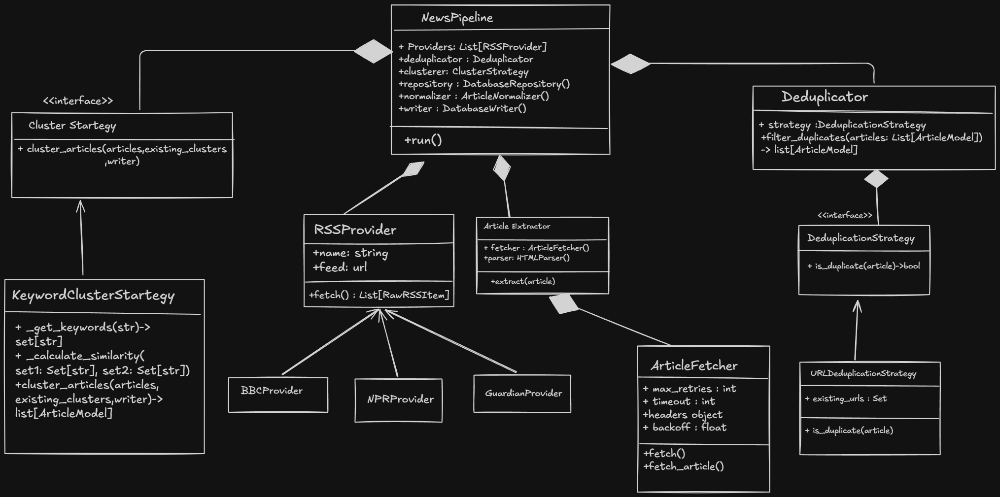

# News Ingestion Pipeline - Scraper Documentation

This folder contains the ingestion pipeline for **News Pulse**, responsible for fetching, normalizing, extracting, deduplicating, clustering, and persisting articles from various news sources.

---

## 1. Class Diagram

Below is the Class Diagram representing the architecture of the News Ingestion Pipeline:



---

## 2. Component Responsibilities

### Ingestion Coordinator
* **`NewsPipeline`**: The orchestrator of the entire ingestion cycle. It aggregates the execution sequence across 5 stages:
  1. **Fetch**: Calls RSS providers to retrieve raw articles.
  2. **Normalize**: Sanitizes and standardizes the attributes of raw articles.
  3. **Extract**: Downloads and parses full article web pages.
  4. **Deduplicate**: Identifies and filters out already ingested or duplicate articles.
  5. **Cluster & Persist**: Groups articles on the same topic and saves the results to PostgreSQL.

### RSS Ingestion
* **`RSSProvider`** *(Abstract Class)*: Standardizes parsing feeds using `feedparser`, timeout limits, custom User-Agents, and isolated error handling.
* **`BBCProvider`**, **`NPRProvider`**, **`GuardianProvider`**: Source-specific providers implementing `RSSProvider` to load feed metadata.

### Data Normalization
* **`ArticleNormalizer`**: Converts unstructured feed items into a canonical `ArticleModel`. It trims whitespace, parses datetimes to UTC, rejects invalid URLs, and maps provider-specific attributes (e.g., `pubDate` or `description`).

### Content Extraction
* **`ArticleExtractor`**: Orchestrates downloading page content using `ArticleFetcher` and stripping boilerplates using `HTMLParser`.
* **`ArticleFetcher`**: Handles download requests, redirect policies, standard headers, and retry budgets with exponential backoff.
* **`HTMLParser`**: Uses BeautifulSoup to extract article titles and clean text bodies, removing scripts, stylesheets, sidebars, navigation bars, footers, and advertisement blocks.

### Deduplication (Strategy Pattern)
* **`Deduplicator`**: Filters incoming articles using an exchangeable strategy context.
* **`DeduplicationStrategy`** *(Interface)*: Defines `is_duplicate(article) -> bool`.
* **`URLDeduplicationStrategy`**: An implementation that detects duplicate URLs case-insensitively, checking against pre-existing database records and preventing intra-batch duplicates.

### Clustering & Persistence
* **`ClusterStrategy`** *(Interface)*: Defines `cluster_articles(articles, existing_clusters, writer=None) -> List[ArticleModel]`.
* **`KeywordClusterStrategy`**: Clusters articles by calculating Jaccard similarity on keyword token sets. New clusters are created on demand.
* **`DatabaseWriter`**: Saves processed data to PostgreSQL. The `get_or_create_cluster` method uses transaction rollback block retries to handle duplicate cluster creation conflicts under high concurrency safely.
* **`DatabaseRepository`**: Queries PostgreSQL to load previously processed URLs and clusters into memory.

---

## 3. How to Run Tests

The test suite consists of unit tests (verifying isolation and stage behaviors) and integration tests (validating the pipeline end-to-end). 

To run the test suite:

1. **Navigate to the `scraper` folder**:
   ```bash
   cd scraper
   ```

2. **Execute all tests**:
   ```bash
   PYTHONPATH=. ./.venv/bin/pytest
   ```

3. **Execute a specific test file**:
   ```bash
   PYTHONPATH=. ./.venv/bin/pytest tests/unit/test_clustering.py
   ```
